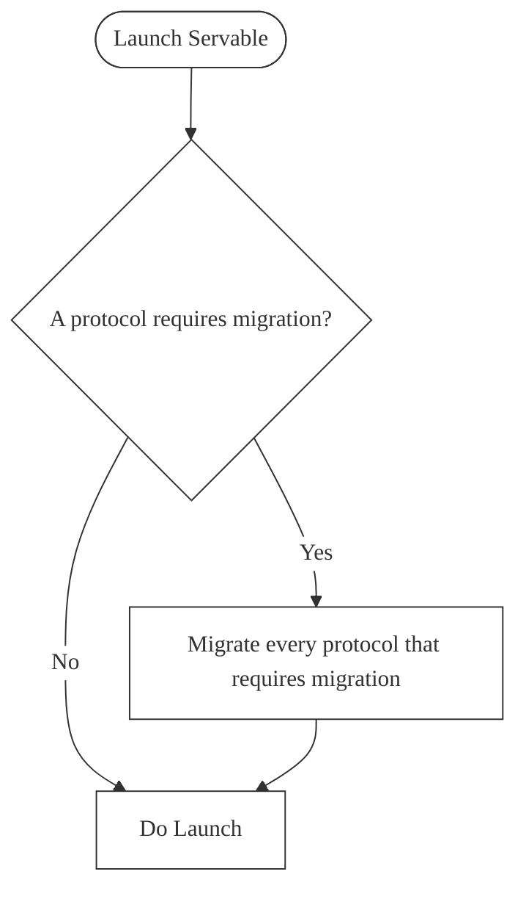

# Configurations
Servable launches with a given configuration. When you generate a new Servable project a list of configurations is provided in servable.engine.config.js.

## Staging configuration
:::warning
This configuration is still experimental
:::
A staging configuration is helpful when you want to test a schema migration on a staging database without touching the production database. It is an extra protection you can put in your production code.

## Production configuration
A production configuration will handle the whole lifecycle of a Servable, including migrations, running it and exposing the API. 