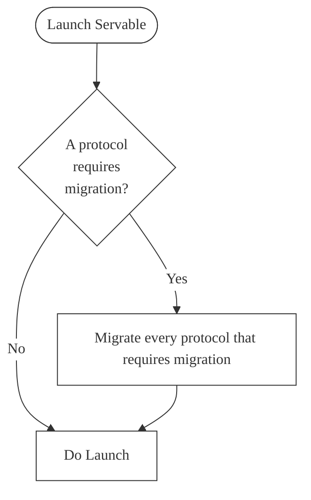

```mermaid
%%{
  init: {
    'theme': 'base',
    'themeVariables': {
      'primaryColor': '#fff',
      'primaryTextColor': '#323232',
      'primaryBorderColor': '#323232',
      'lineColor': '#323232',
      'fontFamily': 'Space Grotesk'
    }
  }
}%%
flowchart TD
    start([Launch Servable]) --> requiresMigration{A protocol \nrequires \nmigration?}
    requiresMigration -- Yes --> migrate[Migrate every protocol that requires migration]
    requiresMigration -- No --> doLaunch[Do Launch]
    migrate --> doLaunch[Do Launch]
```
