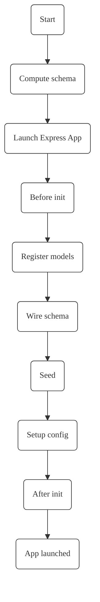

# How Servable server orchestrates a service?

## Schema

Servable takes the separation of concerns to the extreme by allowing every protocol to define a schema it needs to run. This schema has two main entries:
- target: how does the protocol change the targetted model's schema, ie, which field to add
- managed: the models the protocol needs to run

### Final schema
At runtime the Servable server computes the total schema for the whole app based on the multiple protocols that are called.

## Lifecycle

When the server is launched, the servable-engine performs the following tasks:

- Launches an Express app
- Computes the target database schema by aggregating the custom app tables and the protocols applied to those tables
- Checks if a schema migration is necessary. It migrates the schema or not accordingly
- Binds every protocol to the events triggered by the tables that use them
- Exposes every protocol custom function
- Registers jobs

